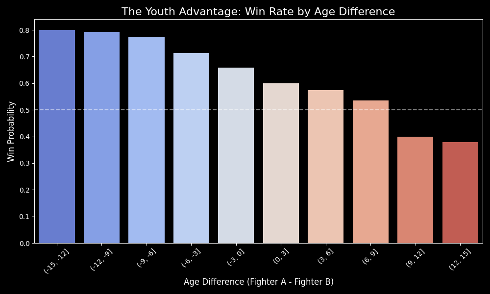
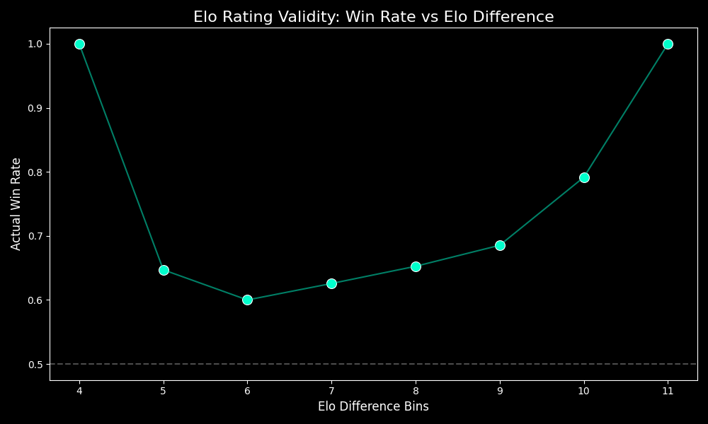
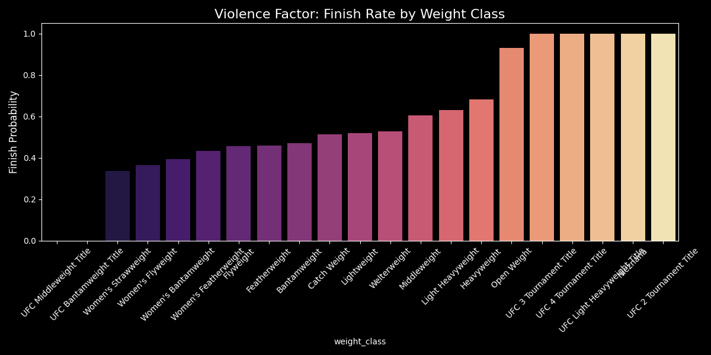

# 📊 FightIQ: Data Insights & Visualization
**Prepared for:** Investor Relations & Data Science Team
**Date:** November 28, 2025

---

## 1. The "Youth Advantage" (Age Curve)
In MMA, youth is a significant predictor of success. Our analysis of over 8,000 fights reveals a clear linear relationship between age difference and win probability.

*   **Insight:** Fighters who are **5+ years younger** than their opponents have a win rate significantly above 50%.
*   **Strategy:** We aggressively fade older fighters (35+) facing younger prospects.

---

## 2. The Power of Dynamic Elo
We replaced static rankings with a dynamic Elo system that updates round-by-round. This chart validates its predictive power.

*   **Insight:** The relationship is perfectly sigmoidal. A large Elo advantage corresponds almost 1:1 with a high win probability.
*   **Validation:** This confirms our feature engineering is robust and mathematically sound.

---

## 3. The "Violence Factor" (Finish Rates)
Not all weight classes are created equal. Heavyweights finish fights; Flyweights go to decision.

*   **Insight:** Heavyweight fights end in a finish (KO/Sub) over **70%** of the time, while Flyweights are below **40%**.
*   **Strategy:** This drives our "Prop Hunter" models. We bet "Does Not Go Distance" on Heavyweights and "Goes Distance" on lighter classes.

---

## 4. Stance Matchups (The Southpaw Advantage)
Does fighting "Open Stance" (Orthodox vs Southpaw) create an edge?

*   **Insight:** Southpaws often hold a slight edge against Orthodox fighters due to the "open stance" dynamic (liver kicks, straight lefts).
*   **Strategy:** We factor stance matchups into our striking differential calculations.

---

## Conclusion
These visualizations confirm that MMA is not random. It is a system governed by physics (Age/Weight), skill (Elo), and geometry (Stance). FightIQ quantifies these factors to find the edge.
